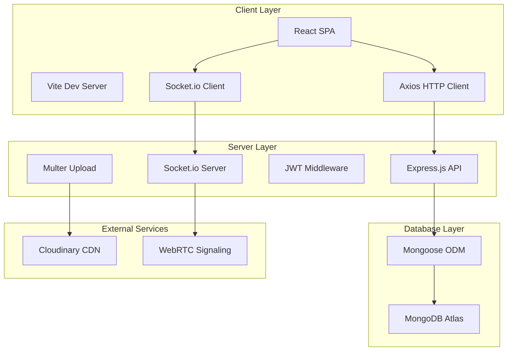
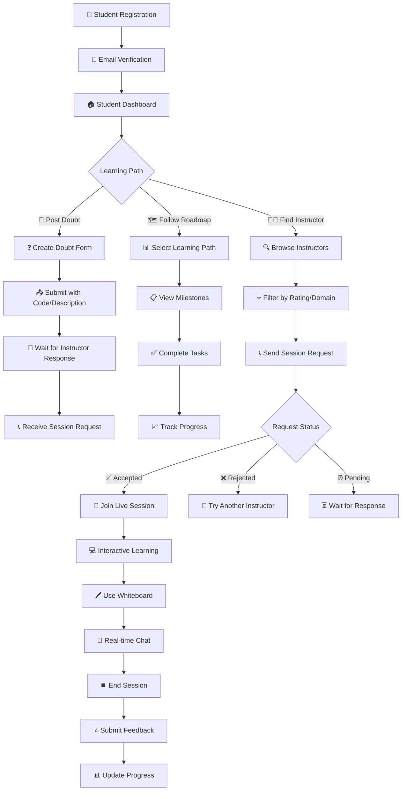
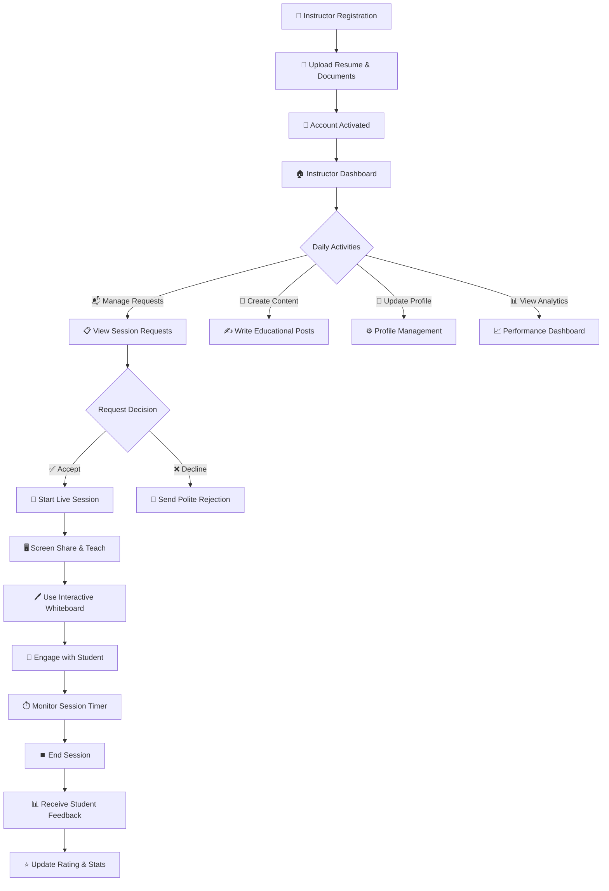
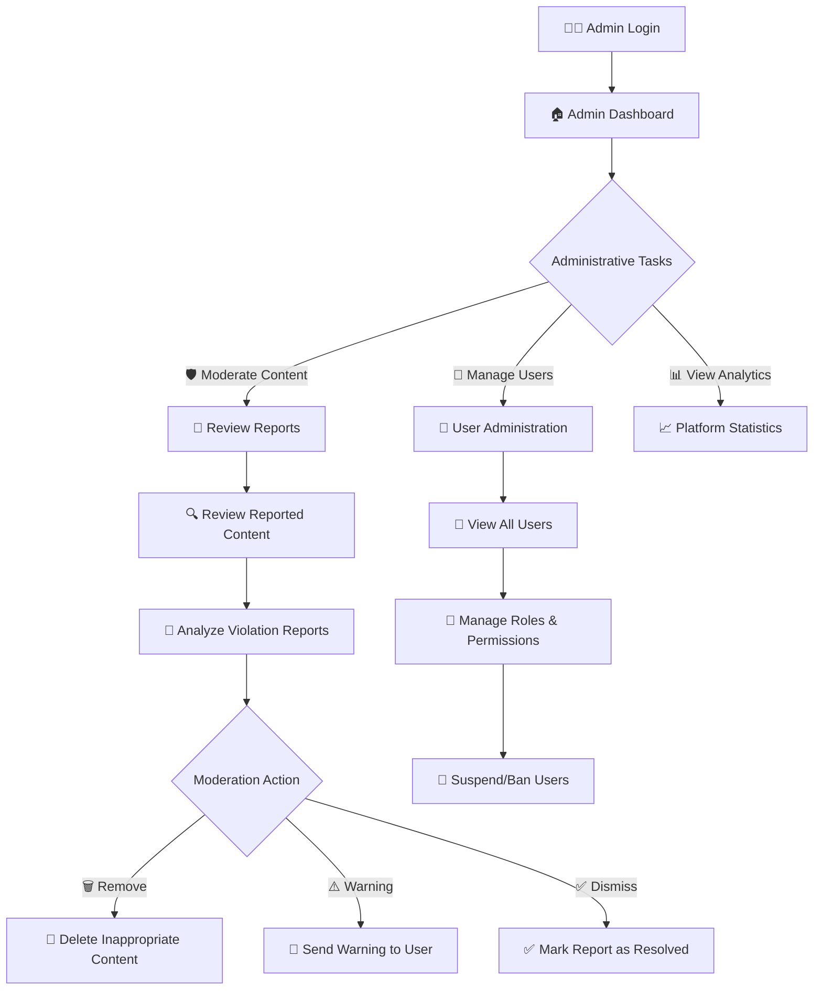

# 🎓 P2P Learning Platform


> A comprehensive peer-to-peer learning platform with real-time video sessions, interactive whiteboards, and structured learning roadmaps.

## 📋 Table of Contents
- [🎯 Overview](#-overview)
- [✨ Key Features](#-key-features)
- [🏗️ System Architecture](#-system-architecture)
- [🔄 Workflow Diagrams](#-workflow-diagrams)
- [🚀 Quick Start](#-quick-start)
- [📁 Project Structure](#-project-structure)
- [🛠️ Technology Stack](#-technology-stack)
- [👥 User Roles & Features](#-user-roles--features)
- [🔧 API Endpoints](#-api-endpoints)
- [📊 Database Models](#-database-models)
- [🎨 Frontend Architecture](#-frontend-architecture)
- [📱 Real-time Features](#-real-time-features)
- [🔐 Security & Authentication](#-security--authentication)
- [🚀 Deployment Guide](#-deployment-guide)

---

## 🎯 Overview
The **Clarify** is a modern, full-stack web application that facilitates peer-to-peer learning through real-time video sessions, doubt resolution, structured learning roadmaps, and comprehensive feedback systems. The platform connects students with verified instructors for personalized learning experiences.

### 🌟 Core Objectives
- **📚 Knowledge Sharing**: Seamless peer-to-peer learning ecosystem.
- **🎥 Real-time Collaboration**: Live video sessions with interactive tools.
- **🗺️ Structured Learning**: Guided learning roadmaps with progress tracking.
- **⭐ Quality Assurance**: Comprehensive feedback and rating system.
- **🛡️ Content Moderation**: Admin-controlled quality and safety measures.

---

## ✨ Key Features

### 👨‍🎓 Student Features
- **🔐 Secure Authentication** with JWT tokens.
- **❓ Smart Doubt System** with code snippets and domain categorization.
- **🔍 Instructor Discovery** with ratings and expertise filtering.
- **📞 Session Requests** with custom messaging.
- **🎥 Interactive Live Sessions** with video, audio, and screen sharing.
- **🖊️ Collaborative Whiteboard** for visual learning.
- **💬 Real-time Chat** with emoji reactions.
- **🗺️ Learning Roadmaps** with milestone tracking.
- **⭐ Feedback System** with detailed ratings.
- **📊 Progress Dashboard** with session analytics.

### 👨‍🏫 Instructor Features
- **📋 Instant Professional Registration** and onboarding.
- **👤 Rich Profile Management** with bio, experience, and domains.
- **📬 Request Management** with accept/reject functionality.
- **🎥 Live Session Hosting** with advanced controls.
- **🖥️ Screen Sharing** and presentation tools.
- **🖊️ Interactive Whiteboard** for explanations.
- **📝 Educational Content Creation** with posts and materials.
- **📊 Performance Analytics** and student feedback.
- **🏅 Reputation System** with detailed ratings.
- **⏱️ Session Timer** with automatic tracking.

### 👨‍💼 Admin Features
- **🛡️ Content Moderation** for posts and doubts.
- **👥 User Management** with role assignments.
- **📈 Platform Analytics** and usage statistics.
- **🚫 Report Management** and violation handling.
- **🔧 System Configuration** and maintenance tools.

---

## 🏗️ System Architecture



---

## 🔄 Workflow Diagrams

### 📚 Complete Student Learning Journey


### 👨‍🏫 Instructor Workflow


### 🛡️ Admin Management System


---

## 🚀 Quick Start

### 📋 Prerequisites
- 📦 **Node.js** (v16+ recommended)
- 🍃 **MongoDB** (Atlas or local)
- ☁️ **Cloudinary Account** (for file uploads)
- 🔧 **Git** (for version control)

### ⚡ Installation

1. **Clone Repository**
   ```bash
   git clone <repository-url>
   cd p2p-learning-platform
   ```

2. **Backend Setup**
   ```bash
   cd backend
   npm install
   cp .env.example .env
   # Configure environment variables
   npm run dev
   ```

3. **Frontend Setup**
   ```bash
   cd ../Frontend
   npm install
   npm run dev
   ```

4. **Initialize Database**
   ```bash
   cd backend
   node seedAdmin.js      # Create admin user
   node seedInstructor.js # Create sample instructor
   ```

### 🔐 Environment Configuration

#### Backend (.env)
```env
# Database
DB_URI=mongodb+srv://<username>:<password>@cluster.mongodb.net/<dbname>
DB_NAME=p2p_learning_platform

# Security
SECRET=<your_jwt_secret>
SESSION=<your_session_secret>

# Cloudinary
CLOUDINARY_CLOUD_NAME=<your_cloud_name>
CLOUDINARY_API_KEY=<your_api_key>
CLOUDINARY_SECRET_KEY=<your_api_secret>

# Server
PORT=5000
NODE_ENV=development
CLIENT_URL=http://localhost:5173
```

#### Frontend (.env)
```env
VITE_API_BASE_URL=http://localhost:5000
VITE_SOCKET_URL=http://localhost:5000
```

---

## 📁 Project Structure

```
p2p-learning-platform/
├── 🔙 backend/
│   ├── 🛣️ API/
│   │   ├── 🎮 controllers/          # Business logic
│   │   │   ├── authController.js    # Authentication
│   │   │   ├── doubtController.js   # Doubt management
│   │   │   ├── sessionController.js # Session handling
│   │   │   ├── feedbackController.js # Rating system
│   │   │   ├── roadmapController.js # Learning paths
│   │   │   └── adminController.js   # Admin operations
│   │   └── 🚏 routes/              # API routes
│   ├── 🛡️ middlewares/             # Auth & validation
│   │   ├── verifyToken.js          # JWT verification
│   │   ├── roleAccess.js           # Role-based access
│   │   └── multer.js               # File upload
│   ├── 📊 models/                  # Database schemas
│   │   ├── User.js                 # User model
│   │   ├── Doubt.js                # Doubt model
│   │   ├── Session.js              # Session model
│   │   ├── Feedback.js             # Feedback model
│   │   ├── Roadmap.js              # Learning roadmap
│   │   └── UserProgress.js         # Progress tracking
│   ├── 🔧 utils/                   # Utilities
│   │   └── cloudinaryUpload.js     # File upload helper
│   ├── 📱 app.js                   # Express configuration
│   ├── 🗄️ db.js                    # Database connection
│   └── 🚀 server.js                # Server entry point
└── 🎨 Frontend/
    ├── 📦 src/
    │   ├── 🔌 api/                 # API services
    │   │   ├── auth.js             # Authentication API
    │   │   ├── doubts.js           # Doubt API
    │   │   ├── feedback.js         # Feedback API
    │   │   ├── roadmaps.js         # Roadmap API
    │   │   └── client.js           # Axios configuration
    │   ├── 🧩 components/          # UI components
    │   │   ├── auth/               # Login/Register
    │   │   ├── features/           # Feature modals
    │   │   ├── layout/             # Navigation
    │   │   └── ui/                 # Reusable UI
    │   ├── 🔄 context/             # React contexts
    │   │   ├── UserContext.jsx     # User state
    │   │   ├── ThemeContext.jsx    # Theme management
    │   │   └── AlertContext.jsx    # Notifications
    │   ├── 📄 pages/               # Page components
    │   │   ├── student/            # Student pages
    │   │   ├── instructor/         # Instructor pages
    │   │   └── admin/              # Admin pages
    │   └── 🎨 App.jsx              # Main app component
    └── ⚙️ vite.config.js           # Vite configuration
```

---

## 🛠️ Technology Stack

### 🔙 Backend Stack
| Technology | Purpose | Version |
|------------|---------|---------|
| **Node.js** | Runtime Environment | Latest LTS |
| **Express** | Web Framework | ^5.2.1 |
| **MongoDB** | Database | ^9.0.2 |
| **Socket.io** | Real-time Communication | ^4.8.3 |
| **JWT** | Authentication | ^9.0.2 |
| **Multer** | File Upload | ^1.4.5 |
| **bcrypt** | Password Hashing | ^3.0.3 |

### 🎨 Frontend Stack
| Technology | Purpose | Version |
|------------|---------|---------|
| **React** | UI Framework | ^19.2.0 |
| **Vite** | Build Tool | ^7.2.4 |
| **React Router** | Routing | ^7.11.0 |
| **Axios** | HTTP Client | ^1.13.2 |
| **Lucide React** | Icons | ^0.562.0 |

---

## 👥 User Roles & Features

### 🎓 Student Capabilities
```javascript
const studentFeatures = {
  authentication: ["register", "login", "profile_management"],
  learning: ["post_doubts", "browse_feed", "join_sessions"],
  interaction: ["request_sessions", "chat", "whiteboard"],
  progress: ["follow_roadmaps", "track_milestones", "view_analytics"],
  feedback: ["rate_instructors", "submit_reviews", "view_history"]
};
```

### 👨‍🏫 Instructor Capabilities
```javascript
const instructorFeatures = {
  profile: ["resume_upload", "bio_management", "domain_expertise"],
  sessions: ["accept_requests", "conduct_sessions", "screen_share"],
  content: ["create_posts", "educational_materials", "whiteboard"],
  analytics: ["session_stats", "student_feedback", "rating_system"],
  tools: ["interactive_whiteboard", "real_time_chat", "session_timer"]
};
```

### 👨‍💼 Admin Capabilities
```javascript
const adminFeatures = {
  moderation: ["content_review", "report_handling", "user_management"],
  analytics: ["platform_stats", "usage_metrics", "performance_data"],
  system: ["user_roles", "platform_settings", "maintenance_tools"]
};
```

---

## 🔧 API Endpoints

### 🔐 Authentication Routes
```http
POST   /api/auth/register          # User registration
POST   /api/auth/login             # User login
POST   /api/auth/logout            # User logout
GET    /api/auth/profile           # Get user profile
PUT    /api/auth/profile           # Update profile
```

### ❓ Doubt Management
```http
GET    /api/doubts                 # Get all doubts
POST   /api/doubts                 # Create new doubt
GET    /api/doubts/:id             # Get specific doubt
PUT    /api/doubts/:id             # Update doubt
DELETE /api/doubts/:id             # Delete doubt
POST   /api/doubts/:id/vote        # Vote on doubt
```

### 🎥 Session Operations
```http
GET    /api/sessions               # Get user sessions
POST   /api/session-requests       # Create session request
GET    /api/session-requests       # Get session requests
PUT    /api/session-requests/:id   # Accept/reject request
POST   /api/sessions               # Start new session
PUT    /api/sessions/:id/end       # End session
```

### ⭐ Feedback System
```http
POST   /api/sessions/feedback      # Submit session feedback
GET    /api/sessions/:id/feedback  # Get session feedback
```

### 🗺️ Learning Roadmaps
```http
GET    /api/roadmaps               # Get available roadmaps
GET    /api/roadmaps/my-progress   # Get user progress
POST   /api/roadmaps/select        # Select roadmap
PUT    /api/roadmaps/progress      # Update milestone progress
```

### 👨‍💼 Admin Operations
```http
GET    /api/admin/users            # Get all users
GET    /api/admin/reports          # Get content reports
PUT    /api/admin/moderate/:id     # Moderate content
```

---

## 📊 Database Models

### 👤 User Schema
```javascript
{
  name: String,                    // Full name
  email: String,                   // Unique email
  password: String,                // Hashed password
  role: ["student", "instructor", "admin"],
  phoneNumber: String,
  rating: Number,                  // Average rating (0-5)
  isVerified: Boolean,             // Instructor verification
  totalRatings: Number,            // Total rating count
  experience: Number,              // Years of experience
  domains: [String],               // Expertise areas
  bio: String,                     // Profile description
  avatar: String,                  // Profile image URL
  resume: String,                  // Resume file path
  github: String,                  // GitHub profile
  statusForSession: ["online", "offline"],
  sessionsAttended: Number,        // Student sessions
  sessionsTaken: Number,           // Instructor sessions
  minutesTaught: Number           // Total teaching time
}
```

### ❓ Doubt Schema
```javascript
{
  title: String,                   // Doubt title
  description: String,             // Detailed description
  domain: String,                  // Subject domain
  codeSnippet: String,            // Optional code
  studentId: ObjectId,            // Student reference
  status: ["open", "in_session", "resolved"],
  isDeleted: Boolean,             // Soft delete
  commentsCount: Number,          // Comment count
  vote: Number                    // Upvote count
}
```

### 🎥 Session Schema
```javascript
{
  doubtId: ObjectId,              // Related doubt
  studentId: ObjectId,            // Student reference
  instructorId: ObjectId,         // Instructor reference
  roomId: String,                 // WebRTC room ID
  status: ["active", "completed", "cancelled"],
  startedAt: Date,               // Session start
  endedAt: Date                  // Session end
}
```

### ⭐ Feedback Schema
```javascript
{
  sessionId: ObjectId,            // Session reference
  from: ["student", "instructor"], // Feedback source
  toUserId: ObjectId,             // Recipient
  ratings: {
    clarity: Number,              // 1-5 rating
    interaction: Number,          // 1-5 rating
    satisfaction: Number          // 1-5 rating
  },
  message: String                 // Optional comment
}
```

### 🗺️ Roadmap Schema
```javascript
{
  name: String,                   // Roadmap name
  domain: String,                 // Subject domain
  milestones: [{
    title: String,                // Milestone title
    description: String,          // Milestone description
    order: Number                 // Sequence order
  }],
  isActive: Boolean              // Availability status
}
```

### 📈 UserProgress Schema
```javascript
{
  userId: ObjectId,               // User reference
  roadmapId: ObjectId,           // Roadmap reference
  completedMilestones: [{
    milestoneId: ObjectId,        // Milestone reference
    completedAt: Date            // Completion timestamp
  }],
  progressPercentage: Number     // Progress percentage (0-100)
}
```

---

## 🎨 Frontend Architecture

### 🔄 Context Providers
- **👤 UserContext**: Authentication state and user profile.
- **🎨 ThemeContext**: Dark/light theme management.
- **🚨 AlertContext**: Global notification system.
- **🔔 NotificationContext**: Real-time notifications via Socket.io.

### 🧩 Component Structure
```
components/
├── 🔐 auth/
│   ├── LoginModal.jsx           # Login form with validation
│   └── RegisterModal.jsx        # Registration with role selection
├── 🌟 common/
│   ├── WelcomeAnimation.jsx     # Animated welcome screen
│   └── WelcomeManager.jsx       # Animation state management
├── ⚡ features/
│   ├── CreateDoubtModal.jsx     # Doubt creation with code editor
│   ├── CreatePostModal.jsx      # Educational post creation
│   └── RequestSessionModal.jsx  # Session request with messaging
├── 🏗️ layout/
│   └── Navbar.jsx               # Role-based navigation
└── 🎛️ ui/
    ├── Button.jsx               # Styled button component
    ├── Card.jsx                 # Content card component
    ├── Input.jsx                # Form input component
    └── Modal.jsx                # Modal dialog component
```

---

## 📱 Real-time Features

### 🎥 WebRTC Video Sessions
- **📹 Video/Audio Streaming**: Peer-to-peer communication.
- **🖥️ Screen Sharing**: Desktop and application sharing.
- **🎛️ Media Controls**: Mute, camera toggle, volume control.
- **📊 Connection Quality**: Real-time connection monitoring.

### 🖊️ Interactive Whiteboard
- **✏️ Drawing Tools**: Pen, shapes, text, eraser.
- **🎨 Customization**: Colors, brush sizes, opacity.
- **🔄 Real-time Sync**: Collaborative drawing experience.
- **💾 Save/Export**: Download whiteboard content.

### 💬 Real-time Communication
- **📨 Instant Messaging**: Socket.io powered chat.
- **😊 Emoji Reactions**: Quick emotional responses.
- **👥 Typing Indicators**: Live typing status.
- **📜 Message History**: Persistent chat logs.

### ⏱️ Session Management
- **⏰ Automatic Timer**: Tracks session duration.
- **👥 Participant Tracking**: Monitors user presence.
- **⏸️ Smart Pause/Resume**: Pauses when participants leave.
- **📊 Session Analytics**: Duration and engagement metrics.

---

## 🔐 Security & Authentication

### 🛡️ Authentication System
- **🔑 JWT Tokens**: Secure stateless authentication.
- **🍪 HTTP-Only Cookies**: Secure token storage.
- **🔒 Password Hashing**: bcrypt with salt rounds.
- **⏰ Token Expiration**: Automatic session management.

### 🔒 Data Protection
- **✅ Input Validation**: Mongoose schema validation.
- **🧹 Data Sanitization**: XSS prevention.
- **🌐 CORS Configuration**: Cross-origin security.
- **📁 File Upload Security**: Type and size validation.
- **🛡️ Role-Based Access**: Permission-based routing.

### 🚫 Security Measures
- **⏱️ Rate Limiting**: API abuse prevention.
- **📊 Error Logging**: Comprehensive error tracking.
- **🔍 Security Headers**: HTTP security headers.
- **🛡️ NoSQL Injection Prevention**: Query sanitization.

---

## 🚀 Deployment Guide

### 🌐 Production Setup

#### 🔙 Backend Deployment
```bash
# Environment setup
export NODE_ENV=production
export DB_URI=mongodb+srv://prod-cluster
export CLIENT_URL=https://your-domain.com

# Install dependencies
npm ci --only=production

# Start server
npm start
```

#### 🎨 Frontend Deployment
```bash
# Build for production
npm run build

# Deploy to Vercel
vercel --prod

# Or deploy to Netlify
netlify deploy --prod --dir=dist
```

### 🐳 Docker Configuration
```dockerfile
# Backend Dockerfile
FROM node:18-alpine
WORKDIR /app
COPY package*.json ./
RUN npm ci --only=production
COPY . .
EXPOSE 5000
CMD ["npm", "start"]
```

#### ☁️ Environment Variables
```yaml
# Production environment
NODE_ENV: production
DB_URI: mongodb+srv://production-cluster
SECRET: ultra-secure-jwt-secret
CLOUDINARY_CLOUD_NAME: prod-cloud
CLIENT_URL: https://your-production-domain.com
PORT: 5000
```
---

<p align="center">
  🌟 Made with ❤️ for the Learning Community
</p>
